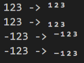

# Javascript functions that transform number to subscript or sperscript **UNICODE**
## Usage
This is a Javascript function that transform integer into superscript or subscript.
These functions is used for the situation when you want to style your output, such as *Discord.js*.

### Superscript
```Javascript
  const number2superscript = require('./tinyDigits').number2superscript
  var superscript = number2superscript(123)
```

### Subscript
```Javascript
  const number2subscript = require('./tinyDigits').number2subscript
  var subscript = number2subscript(123)
```
